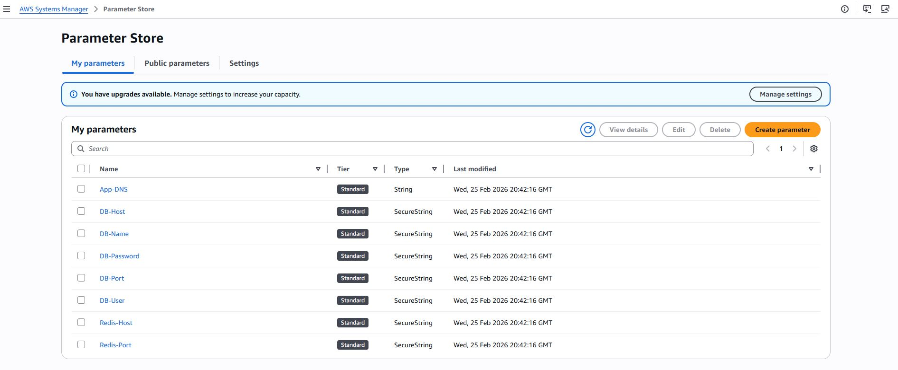
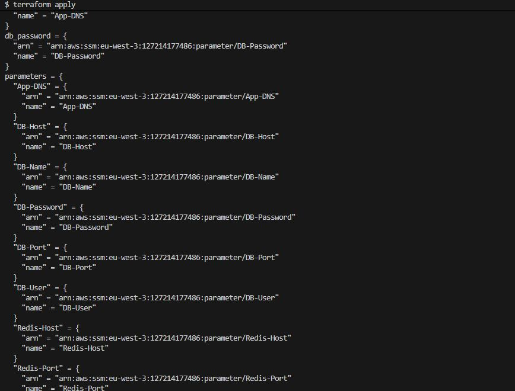

# Manage Multiple Params with Terraform

This is a simple example of how to manage multiple parameters in AWS Systems Manager Parameter Store using Terraform. The example demonstrates how to create multiple parameters with different types and values.
## Prerequisites
- Terraform installed on your local machine.
- An AWS account with the necessary permissions to create SSM parameters.
## Steps to Create Multiple Parameters
1. Create a new directory for your Terraform configuration and navigate to it:
```bash
mkdir terraform-ssm-parameters
cd terraform-ssm-parameters
```
2. Create a new file named `main.tf` and add the following Terraform configuration:

```hcl
provider "aws" {
  region = "eu-west-3" # Change to your desired region
}




terraform apply

